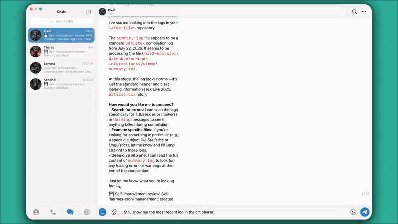

# Kallilex

[](https://github.com/LStoneyy/kallilex/actions/workflows/ci.yml)

> A tiny, local-first writing utility for spelling, rewriting, and polishing text from anywhere on your desktop.

**Website:** [kallilex.webcommits.info](https://kallilex.webcommits.info/)



## Idea

Kallilex lives quietly in the macOS menu bar, the Linux tray, or the Windows notification area. Instead of opening a browser, switching to a chatbot, or installing a large writing suite, you select some text, press a shortcut, and Kallilex captures it automatically, edits it in a small popover, and puts the result straight back where it came from.

The workflow is:

1. Select text in any application.
2. Press the global shortcut (**⌥⌘K** on macOS, **Ctrl+Alt+K** on Linux and Windows; configurable in Settings).
3. Kallilex captures the selection automatically and opens a popover with that text.
4. Run a local spell check or an AI action: **Rewrite**, **Shorten**, **Improve clarity**, or a custom prompt.
5. **Copy** the result to the clipboard, or **Replace** it back into the app you started from.

Kallilex stays fast, unobtrusive, privacy-conscious, free, and open source.

## Installation (macOS)

Kallilex ships as a macOS app, distributed as a zip on [GitHub Releases](../../releases).

1. Download `Kallilex-vX.Y.Z-macos-universal.zip` from the latest release.
2. Unzip it and drag `Kallilex.app` to `/Applications`.
3. On first launch, macOS blocks the app because it is signed with a self-signed certificate, not notarized by Apple (there is no Apple Developer notarization in v1): a dialog says the app could not be verified, offering only **Done** and **Move to Trash**. Click **Done**, then open **System Settings → Privacy & Security**, scroll down to the security section, and click **"Open Anyway"**; confirm the follow-up prompt. This approval is only needed once. (On macOS 15 Sequoia and later, the old right-click → Open shortcut no longer works for unnotarized apps.)
4. On the first capture, macOS prompts for **Accessibility** permission — grant it under **System Settings → Privacy & Security → Accessibility**. Kallilex needs this to read the selected text from the frontmost app.

Releases are signed with a stable self-signed certificate, so the Accessibility permission survives app updates. When updating from v0.4.0 or earlier (which were ad-hoc signed), the old permission entry is stale and the checkbox will not stick — run `tccutil reset Accessibility com.webcommits.kallilex` once (or remove the Kallilex entry in the Accessibility list), then grant the permission again.

Notarized builds and a Homebrew cask are on the roadmap; see [Later](#later).

## Linux

Kallilex also ships for Linux, distributed as `.deb`, `.rpm`, and AppImage packages on [GitHub Releases](../../releases).

Support depends on your session type:

- **X11 sessions** — full functionality: global shortcut, automatic capture, and Replace all work as on macOS.
- **Wayland sessions** — support depends on which XDG desktop portals your compositor provides; Kallilex detects this at startup and enables each feature independently. Settings → Accessibility shows which capabilities are live.
  - KDE Plasma and GNOME 48+: the full loop — global shortcut (bound through the system; rebind it in your desktop's keyboard settings) and automatic Replace. The first Replace asks for the remote-desktop input permission once via your desktop's own dialog; the grant persists until you revoke it in system settings. That permission is optional: turn "Use automatic paste-back" off in Settings → General and Kallilex never asks for it — capture keeps working from your current selection, and results are copied instead, automatically if you also turn on "Copy the result automatically".
  - Hyprland: global shortcut works; Replace is unavailable (no RemoteDesktop portal) — use Copy.
  - Sway and other wlroots compositors: degraded mode — open Kallilex from the tray ("Open Kallilex") to capture the primary selection, use Copy.

Install:

- **Debian/Ubuntu:** `sudo apt install ./Kallilex-*.deb`
- **Fedora:** `sudo dnf install ./Kallilex-*.rpm`
- **AppImage:** download it, `chmod +x Kallilex-*.AppImage`, then run it directly. On Wayland, prefer the `.deb`/`.rpm`: the portal-bound global shortcut requires an installed desktop entry whose basename matches the bundle identifier, which only those packages ship — an AppImage run under Wayland falls back to opening Kallilex from the tray for capture. On X11 the AppImage is fully equivalent to the other packages.

On GNOME, the tray icon requires the AppIndicator extension (`gnome-shell-extension-appindicator`) — without it, the icon simply won't show up; that's the extension missing, not the app being broken.

Kallilex picks up system Hunspell dictionaries from `/usr/share/hunspell` and `/usr/share/myspell` automatically and prefers them; it also bundles fallback `en_US` and German dictionaries for machines without system dictionaries installed. The bundled dictionaries carry their own licenses (the German dictionary is GPL-licensed), with the license texts included in the package; the app itself remains Apache-2.0.

## Windows

Kallilex also ships for Windows, distributed as a single NSIS installer on [GitHub Releases](../../releases).

Supported: Windows 10 21H2+ and Windows 11, x86_64.

Install:

1. Download `Kallilex-vX.Y.Z-windows-x86_64-setup.exe` from the latest release.
2. Run it — the installer installs Kallilex per-user, with no admin prompt.
3. On first launch, because the binary is unsigned (no code-signing certificate in v1), Windows SmartScreen shows a "Windows protected your PC" dialog: click **More info**, then **Run anyway**. This approval is only needed once.

Kallilex lives in the notification area, never the taskbar or Alt-Tab, with `Ctrl+Alt+K` as the default global shortcut.

Spell checking uses the built-in Windows Spell Checking API, fully offline, with the spell-check languages installed for your display languages. To add one, go to **Settings → Time & Language → Language & region**, add or select a language, and enable its "Basic typing" feature.

Provider API keys are stored in Windows Credential Manager — never written to config files.

Two honest limitations: apps running as administrator (elevated) are off-limits to Kallilex, because Windows' User Interface Privilege Isolation (UIPI) blocks synthetic input and accessibility reads across integrity levels — capture reports no selection and Replace reports a clear failure rather than silently doing nothing; and apps that expose no accessible text (some Electron and custom-toolkit apps) fall back to the synthetic-copy capture path described below.

## Capture

Capture is automatic — there is no manual paste step. On macOS:

- **Primary path:** the macOS Accessibility API reads the current selection directly from the frontmost app. This requires the one-time Accessibility permission above.
- **Fallback:** for apps that don't expose their selection through Accessibility, Kallilex falls back to a clipboard-based capture (a synthetic ⌘C). The clipboard is backed up before the fallback runs and restored afterwards, so your existing clipboard contents are never lost.

See [Linux](#linux) for the Linux capture paths. On Windows, capture reads the current selection via UI Automation (`TextPattern`), with the same clipboard-backed-up-and-restored synthetic-copy fallback for apps that expose no accessible text — see [Windows](#windows) for the platform's honest limitations.

## Popover

The popover shows the captured text as editable content, plus:

- local spell check, powered by macOS's native `NSSpellChecker` (a Hunspell-compatible engine on Linux, the Windows Spell Checking API on Windows) — fully offline;
- action buttons: **Rewrite**, **Shorten**, **Improve clarity**, and **Custom prompt**;
- a privacy badge showing whether the active AI provider is **Local**, **LAN**, or **Cloud**, derived from its base URL before any request is sent.

There is no diff view in v1 — running an action replaces the editable text in the popover with the result, in place.

## Results: Copy or Replace

Once you're happy with the result:

- **Copy** leaves the result on the clipboard for you to paste manually.
- **Replace** pastes the result back into the app you captured it from (via a synthetic ⌘V on macOS, Ctrl+V on Linux and Windows), then restores your original clipboard contents afterwards. On Linux, Replace needs X11, or a Wayland compositor with the RemoteDesktop portal and "Use automatic paste-back" left on — see [Linux](#linux). On Windows, Replace activates the source window (`SetForegroundWindow`) before pasting; it does not work against apps running elevated — see [Windows](#windows).

## Privacy

- **Local-first spell check.** Spell checking is fully offline and works without an AI provider or network access — macOS's native `NSSpellChecker`, on Linux a Hunspell-compatible engine, or on Windows the built-in Windows Spell Checking API.
- **Local / LAN / Cloud badge.** Before any AI request, the popover classifies the active provider from its base URL and shows whether it's local, on your LAN, or a cloud endpoint — so you always know where your text is about to go.
- **System-keychain-only API keys.** Provider API keys are stored in the macOS Keychain, on Linux the Secret Service (gnome-keyring / KWallet), or on Windows Credential Manager — never written to config files.
- **No accounts, no telemetry, no analytics.** Kallilex has no cloud backend and does not phone home.
- **No logs of your text.** The app does not log the content you select or edit.
- Text only leaves your machine when you explicitly invoke an AI action against a provider configured with a remote base URL.

## Name

**Kallilex** combines Greek *kalli-* ("beautiful") and *lexis* ("word / expression"), with a nod to the ancient term *kallilexia* for elegant expression.

## Tech stack

- **Tauri 2** — the desktop shell: system tray / menu bar icon, configurable global shortcut, clipboard access, opt-in autostart (off by default), single-instance behavior, and persistent non-secret settings
- **Rust** — native integrations, provider calls, clipboard/selection logic, and local checking
- **Svelte + TypeScript** — the popover and settings UI

### Native integrations

Selected-text capture and replacement live behind one platform abstraction with three backends:

- **macOS** — the Accessibility APIs, with a clipboard-based fallback for applications that don't expose their selection cleanly.
- **Linux** — on X11, `x11rb` queries frontmost-app identity, and key synthesis and window activation work directly. On Wayland, the GlobalShortcuts portal binds the shortcut and the RemoteDesktop portal synthesizes the keystrokes Replace needs, each only where the compositor supports it; primary-selection reads go through `arboard`. Wayland has no cross-client window query protocol, so frontmost-app identity is unavailable there.
- **Windows** — UI Automation (`IUIAutomation`/`TextPattern`) reads the selection, `GetForegroundWindow` provides app identity, and Replace works via `SetForegroundWindow` plus `SendInput`.

The user-facing consequences of these backends are described under [Capture](#capture), [Linux](#linux), and [Windows](#windows).

### Spell checking

Spell checking is independent from AI and sits behind one `SpellChecker` seam: the native spell-checking facilities on macOS, `spellbook` (a pure-Rust Hunspell-compatible engine) with system dictionaries on Linux, and the Windows Spell Checking API on Windows.

### AI provider layer

Kallilex has one internal provider interface backed by a single OpenAI-compatible adapter (Chat Completions API), with presets for:

```text
Provider
└── OpenAI-compatible (Chat Completions)
    ├── OpenAI
    ├── Ollama       (http://localhost:11434/v1)
    ├── LM Studio    (http://localhost:1234/v1)
    └── Custom base URL
```

Each provider profile is configured with:

- name;
- base URL;
- model;
- timeout;
- optional custom headers;
- optional API key (stored in the macOS Keychain, on Linux the Secret Service via gnome-keyring/KWallet, or on Windows Credential Manager — never in config files).

Ollama and LM Studio expose OpenAI-compatible APIs, so they reuse the generic adapter rather than getting separate hard-coded implementations.

Rust pieces involved:

- `reqwest` — HTTP
- `serde` / `serde_json` — configuration and API payloads
- `tokio` — async work
- Tauri Store — non-secret preferences

## Building from source

Prerequisites:

- Rust (stable toolchain)
- Node 22+
- pnpm 11

```sh
pnpm install
pnpm tauri dev     # run in development
pnpm tauri build   # build a release app bundle
```

CI (`.github/workflows/ci.yml`) runs `pnpm check` (Svelte/TypeScript typecheck), `pnpm test` (frontend tests), `cargo clippy` and `cargo test` for the Rust side, and a full `tauri build`, on macOS, Linux, and Windows.

## Later

- Developer-ID signing and notarization;
- Homebrew cask;
- auto-updater;
- richer diff view and one-click suggestion acceptance;
- user-defined rewrite presets;
- per-app presets;
- optional Harper integration for English grammar/style;
- llama.cpp process management instead of requiring an external server;
- plugin/provider SDK;
- import/export of configuration without secrets.

## Principles

1. **Local first.** Spell checking works without internet access.
2. **Provider agnostic.** Users choose where AI requests go.
3. **Fast path first.** Select → shortcut → action → replace.
4. **No browser extension required.** Kallilex works across applications.
5. **Minimal footprint.** No Electron-style always-running web application.
6. **Transparent.** Open source, free, and explicit about when text leaves the machine.
7. **No telemetry by default.**
8. **Text belongs to the user.**

## License

The project is free and open source under the Apache 2.0 licence. See [LICENSE](LICENSE).
